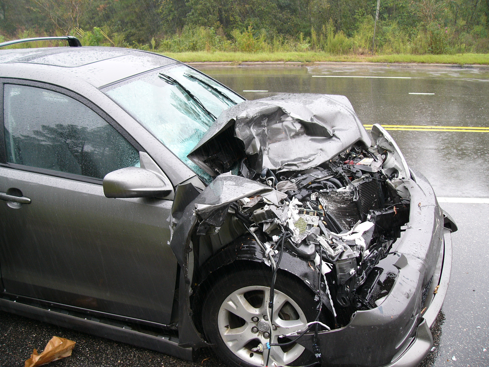

# DATA_205

**Vision Zero: Automating Validation and Relocation of Crash Location
Data**

This repository documents a capstone project for Montgomery County
Community College's Data Science Certificate Program. This project was
in collaboration with Montgomery County's Vision Zero Initiative and the
aim of the project was to review car crash locations from the Automated
Crash Reporting System (ACRS) used by the county and suggest better
locations for the crashes. In addition to this goal, this project
includes some preliminary analysis of the crashes after the crash
locations had been validated and relocated.

This repository contains the following files/documents:

-   Crashes_locations_cleaned.csv – Data set with information about
    crashes in the county from 2015 to 2023.

-   MDOT_SHA_Mile_Points\_(100th).csv – Mile points data with geometric
    features for every 100th of a mile along County roadways.

-   Capstone_GIT.ipynb: Notebook with python code for cleaning,
    exploratory data analysis, clustering and forecasting. Please note
    that to run this notebook, you will have to provide an API key for
    the google maps API.

-   Cleaned_data_withflags.csv - An output of running the Capstone
    notebook that contains the original data set along with some new
    columns including the relocated coordinates.

-   Flagged_crashes.csv - An output of running the Capstone notebook.
    Contains the coordinates for the flagged locations - locations where
    the distance between the ACRS coordinates and the relocated crash
    coordinates is greater than 1000 feet.

-   flagged.geojson - An output of running the Capstone notebook.
    Contains the coordinates and cluster grouping for the flagged
    locations.

-   relocated.geojson - An output of running the Capstone notebook. It
    contains the coordinates for all crashes after relocation.

-   ACRS.geojson - An output of running the Capstone notebook. It
    contains the coordinates for the crashes as they appear in the ACRS
    data set.

-   VZ.geojson- An output of running the Capstone notebook. It contains
    the coordinates for the all crashes validated by the vision zero
    team (2015-2022).

-   Map.ipynb - Python notebook for maps of the ACRS and relocated
    crashes, as well as the flagged locations. ACRS crashes refer to the
    initial ACRS coordinates, relocated refers to the new locations
    after running the code in the Capstone notebook, and the flagged
    locations are those where the distance between the ACRS coordinates
    and relocated coordinates is more than 1000 feet.

-   Accident map.html – An output of the map notebook which contains
    locations of the car crashes prior to relocation (ACRS) and after
    relocation (relocated crashes).

-   Clustered Accidents map.html – An output of the map notebook that
    contains flagged locations overlayed on the police districts in the
    county.
